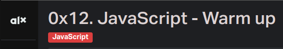

# Table of contents
Project Code | Project Name | Description
----- | ------ | -----------
[0x00] | [First constant, first print](./0-javascript_is_amazing.js) | A script that prints “JavaScript is amazing”
[0x01] | [3 languages](./0x01-python-if_else_loops_functions) | A script that prints "C is fun", "Python is Cool" and "JavaScript is amazing" on different lines
[0x02] | [Arguments](./2-arguments.js) | A script that prints a message depending of the number of arguments passed
[0x03] | [Value of my argument](./3-value_argument.js) | A script that prints the first argument passed
[0x04] | [Create a sentence](./4-concat.js) | A script that prints two arguments passed to it, joined by “ is ”;
[0x05] | [An Integer](./5-to_integer.js) | A script that prints My number: <first argument converted in integer> if the first argument can be converted to an integers
[0x06] | [Loop to languages](./6-multi_languages_loop.js) | A script that prints 3 lines: (like 1-multi_languages.js) but by using an array of string and a loop
[0x07] | [Value of my argument](./3-value_argument.js) | A script that prints the first argument passed
  